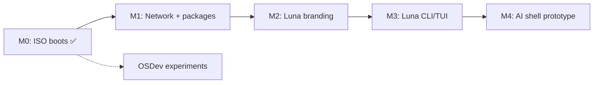

# Roadmap

Этапы упорядочены так, чтобы каждый давал **работающий артефакт**, который можно показать и протестировать.

## Фаза 0 — Фундамент ✅

**Цель:** репозиторий, документация, выбор стека, первый ISO.

- [x] Документация проекта (`/docs`)
- [x] Скрипт сборки rootfs (`build/build-rootfs.sh`)
- [x] Скрипт сборки ISO (`build/build-iso.sh`)
- [x] Docker Compose (dual-arch: x86_64 + aarch64)
- [x] Загрузка в VirtualBox (Apple Silicon) и QEMU
- [x] Login + shell + брендинг Luna

→ Подробности: [milestone-0.md](milestone-0.md)

**Завершено:** июнь 2026

---

## Фаза 1 — Минимально живая система

**Цель:** система не только грузится, но и полезна для базовых задач.

- Сеть: DHCP (`udhcpc` или `ifupdown-ng`)
- Установка пакетов из репозитория Alpine (online) или расширение локального ISO-репо
- Пользователь non-root + sudo (опционально)
- Persistent storage в VM (виртуальный диск, не только live)
- Чистая загрузка без косметических предупреждений

**Критерий готовности:** внутри VM можно `ping 8.8.8.8` и `apk add vim`.

**Оценка:** 1–2 недели

---

## Фаза 2 — Идентичность Luna

**Цель:** это уже «Luna», а не «голый Alpine в другой обёртке».

- Кастомный prompt, login banner
- Расширенный набор пакетов по умолчанию (curl, git, editor)
- Документ «что входит в Luna by default»
- Версионирование и changelog образа

**Критерий готовности:** при загрузке однозначно видно Luna; есть файл версии и описание состава.

**Оценка:** ~1 неделя

---

## Фаза 3 — Luna userspace

**Цель:** первые собственные программы, не только конфиги.

- Утилита `luna` (CLI): версия, статус, help
- Простой TUI — опционально
- OpenRC-сервис для будущего agent (заглушка)

**Критерий готовности:** команда `luna` работает из коробки.

**Оценка:** 2–4 недели

---

## Фаза 4 — Зачатки AI-shell (далёкое будущее)

**Цель:** прототип «скажи системе, что сделать» — **в userspace**, не в kernel.

- Локальный или API-based LLM
- Intent → shell command / service action
- Sandbox, подтверждение опасных команд

**Не начинаем**, пока не закрыты фазы 1–2.

---

## Параллельный трек (опционально): OSDev

Отдельный репозиторий или `experiments/kernel/`:

- Multiboot, GDT, paging
- Не блокирует основной продукт

---

## Зависимости между фазами

