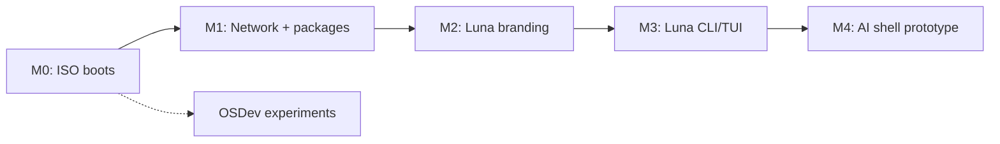

# Roadmap

Этапы упорядочены так, чтобы каждый давал **работающий артефакт**, который можно показать и протестировать.

## Фаза 0 — Фундамент (текущая)

**Цель:** репозиторий, документация, выбор стека, первый ISO.

- [x] Документация проекта (`/docs`)
- [ ] Скрипт сборки rootfs
- [ ] Скрипт сборки ISO
- [ ] Загрузка в VirtualBox/QEMU

→ Подробности: [milestone-0.md](milestone-0.md)

**Оценка:** 1–2 недели part-time

---

## Фаза 1 — Минимально живая система

**Цель:** система не только грузится, но и полезна для базовых задач.

- Сеть: DHCP (`udhcpc` или `dhcpcd`)
- Пакетный менеджер: установка пакетов из репозитория Alpine
- Пользователь non-root + sudo (опционально)
- Persistent storage в VM (виртуальный диск, не только live)
- Serial console для отладки без GUI

**Критерий готовности:** внутри VM можно `ping 8.8.8.8` и `apk add vim`.

**Оценка:** 1–2 недели

---

## Фаза 2 — Идентичность Luna

**Цель:** это уже «Luna», а не «голый Alpine в другой обёртке».

- Кастомный `/etc/issue`, motd, hostname
- Свой login banner и prompt
- Минимальный набор предустановленных пакетов (curl, git, editor)
- Документ «что входит в Luna by default»
- Версионирование образа (`/etc/luna-release`)

**Критерий готовности:** при загрузке видно Luna; есть файл версии.

**Оценка:** ~1 неделя

---

## Фаза 3 — Luna userspace

**Цель:** первые собственные программы, не только конфиги.

- Утилита `luna` (CLI): версия, статус, help
- Простой TUI (Python + textual / Rust + ratatui) — опционально
- Systemd/OpenRC-сервис для будущего agent (заглушка)

**Критерий готовности:** команда `luna` работает из коробки.

**Оценка:** 2–4 недели

---

## Фаза 4 — Зачатки AI-shell (далёкое будущее)

**Цель:** прототип «скажи системе, что сделать» — **в userspace**, не в kernel.

- Локальный или API-based LLM
- Тонкий слой: intent → shell command / service action
- Безопасность: sandbox, подтверждение опасных команд

**Не начинаем**, пока не закрыты фазы 0–2.

---

## Параллельный трек (опционально): OSDev

Для понимания низкого уровня — отдельный репозиторий или папка `experiments/kernel/`:

- Multiboot, GDT, paging (tutorial osdev.org или Writing an OS in Rust)
- Не блокирует основной продукт

---

## Зависимости между фазами

