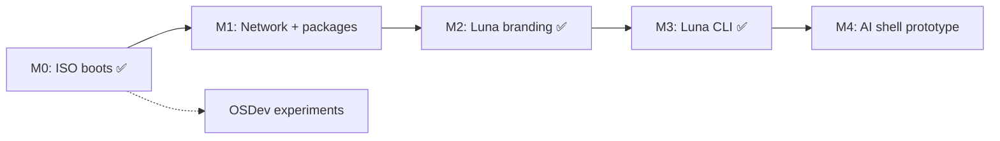

# Roadmap

Этапы упорядочены так, чтобы каждый давал **работающий артефакт**, который можно показать и протестировать.

## Фаза 0 — Фундамент ✅

**Цель:** репозиторий, документация, выбор стека, первый ISO.

- [x] Документация проекта (`/docs`)
- [x] Скрипт сборки rootfs (`build/build-rootfs.sh`)
- [x] Скрипт сборки ISO (`build/build-iso.sh`)
- [x] Docker Compose (dual-arch: x86_64 + aarch64)
- [x] Загрузка в VirtualBox (Apple Silicon) и QEMU
- [x] Login + shell + брендинг Luna

→ Подробности: [milestone-0.md](milestone-0.md)

**Завершено:** июнь 2026

---

## Фаза 1 — Минимально живая система ✅

**Цель:** система полезна для базовых задач.

- [x] Сеть: DHCP + `network-dhcp.start`
- [x] Online `apk add` (CDN после boot, без конфликта с ISO)
- [x] Пользователь `luna` + sudo, openssh
- [x] Пакеты: curl, git, vim, htop, e2fsprogs
- [x] Persist: диск `LUNA_DATA` → `/mnt/persist`
- [x] Чистая загрузка без косметических предупреждений (initramfs offline, mdev)

**Критерий:** `curl`, `apk add`, `htop` — **выполнен** (июнь 2026)

---

## Фаза 2 — Идентичность Luna ✅

**Цель:** это уже «Luna», а не «голый Alpine в другой обёртке».

- [x] Кастомный prompt, login banner
- [x] Расширенный набор пакетов по умолчанию (curl, git, editor)
- [x] Документ «что входит в Luna by default» → [default-packages.md](default-packages.md)
- [x] Версионирование и changelog образа → [CHANGELOG.md](../CHANGELOG.md)

**Критерий:** при загрузке однозначно видно Luna; есть файл версии и описание состава — **выполнен** (июнь 2026)

**Завершено:** июнь 2026

---

## Фаза 3 — Luna userspace ✅

**Цель:** первые собственные программы, не только конфиги.

- [x] Утилита `luna` (CLI): version, status, help
- [x] Простой TUI — `luna tui`
- [x] OpenRC-сервис для будущего agent (`luna-agent` stub)

**Критерий:** команда `luna` работает из коробки — **выполнен** (июнь 2026)

**Завершено:** июнь 2026

→ [luna-cli.md](luna-cli.md)

---

## Фаза 4 — Luna Shell (в работе)

**Цель:** прототип «скажи системе, что сделать» — **в userspace**, не в kernel.

- [x] Welcome-screen (`luna` без args) — 🌙, Claude-style card **0.5.0**
- [x] `luna think` — анимация фаз (preview agent)
- [x] SSH empty password для dev-тестов с Mac
- [ ] Локальный или API-based LLM
- [ ] Intent → shell command / service action
- [ ] Sandbox, подтверждение опасных команд

UI: terminal-first — см. [ui-strategy.md](ui-strategy.md), [luna-shell-tui-sketch.txt](luna-shell-tui-sketch.txt).

**Начато:** июнь 2026 (0.5.0)

---

## Параллельный трек (опционально): OSDev

Отдельный репозиторий или `experiments/kernel/`:

- Multiboot, GDT, paging
- Не блокирует основной продукт

---

## Зависимости между фазами

